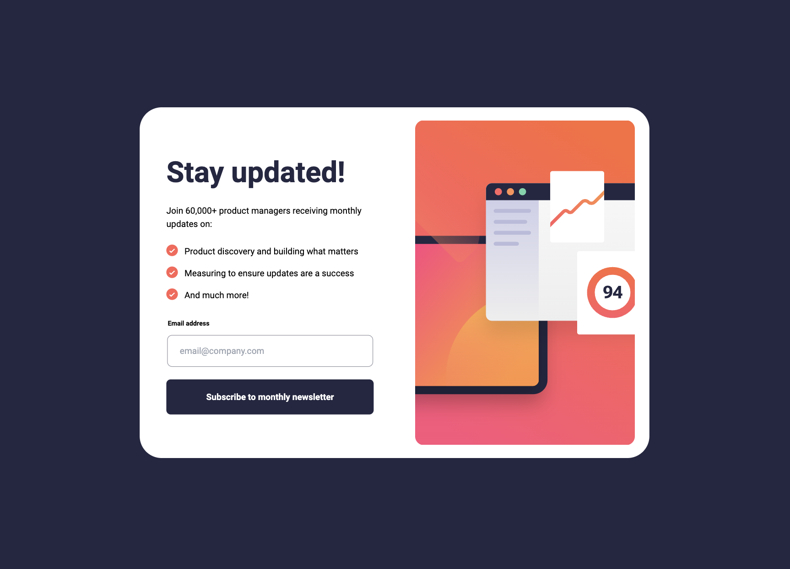
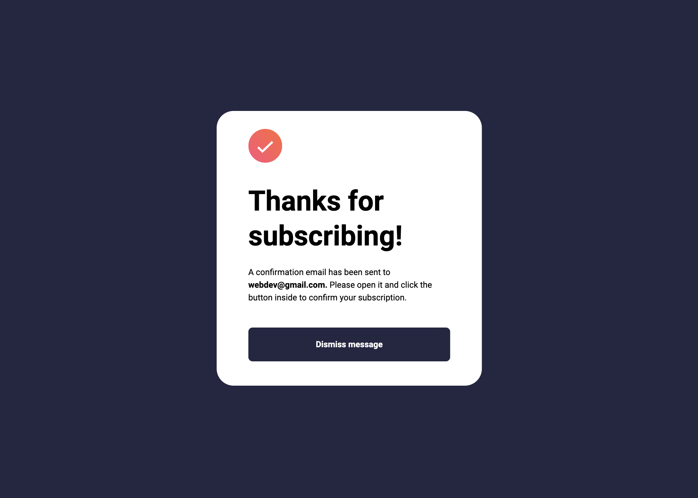
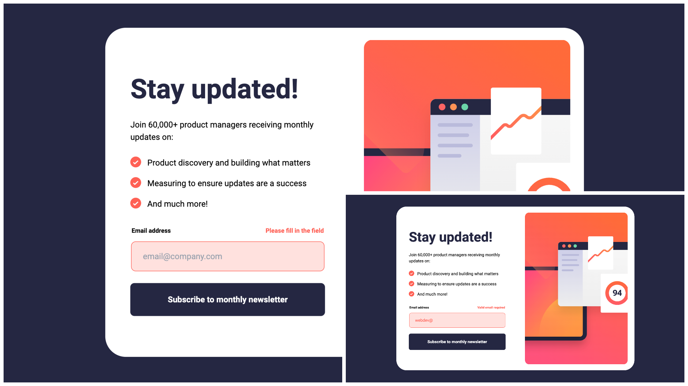
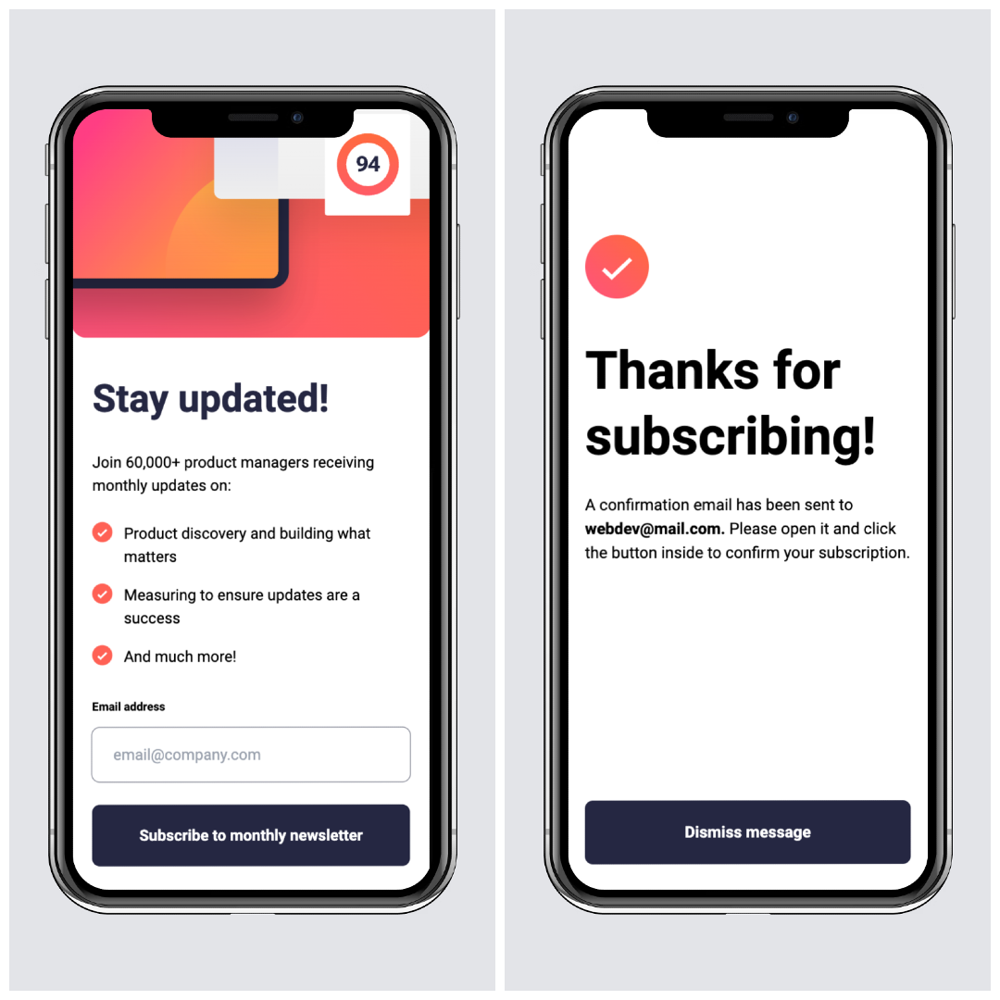

# Frontend Mentor - Newsletter sign-up form with success message solution

This is a solution to the [Newsletter sign-up form with success message challenge on Frontend Mentor](https://www.frontendmentor.io/challenges/newsletter-signup-form-with-success-message-3FC1AZbNrv). Frontend Mentor challenges help you improve your coding skills by building realistic projects. 

## Table of contents

- [Overview](#overview)
  - [The challenge](#the-challenge)
  - [Screenshot](#screenshot)
  - [Links](#links)
- [My process](#my-process)
  - [Built with](#built-with)
  - [What I learned](#what-i-learned)
  - [Continued development](#continued-development)
  - [Useful resources](#useful-resources)
- [Author](#author)
- [Acknowledgments](#acknowledgments)

## Overview

### The challenge

Users should be able to:

- Add their email and submit the form
- See a success message with their email after successfully submitting the form
- See form validation messages if:
  - The field is left empty
  - The email address is not formatted correctly
- View the optimal layout for the interface depending on their device's screen size
- See hover and focus states for all interactive elements on the page

### Screenshot

### Links

- Solution URL: [GitHub](https://github.com/svetikbaihe/newsletter.git)
- Live Site URL: [Vercel](https://newsletter-k7zskjjj2-svetas-projects-dd4a3c95.vercel.app/)

## My process

### Built with

- HTML5 markup
- SCSS/SASS
- Flexbox
- Mobile-first workflow
- Tailwind
- Prettier
- OOP
- Vite(yarn)

### What I learned

- RegEx
- Email validation

### Continued development

Email validation was definitely a difficult task. Not to mention, responsive design is no joke either.

### Useful resources

- [Фрілансер по життю](https://fls.guru/) - It always helps me with the background CSS property. On this website you can also find useful cheetsheets regarding CSS position, flex and many other things made by Ukrainian web developer Eugene.
- [MockupBro](https://mockupbro.com/) - This is a great online mockup generator.
- [PIXLR](https://pixlr.com/) - Perfect free online photo editor for easy and quick collages.

## Author

- Frontend Mentor -
  [@svetikbaihe](https://www.frontendmentor.io/profile/svetikbaihe)

## Acknowledgments

- Kudos to my mentor - [@ArtemPapusha](https://github.com/ArtemPapusha)
